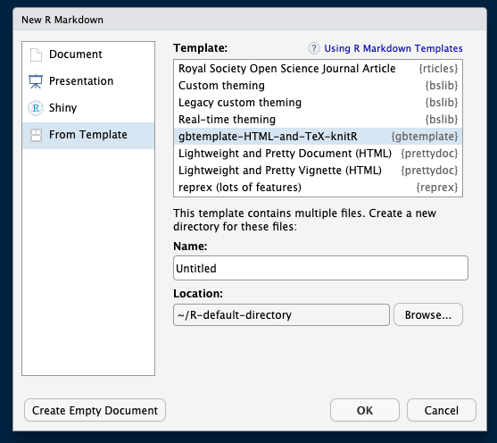
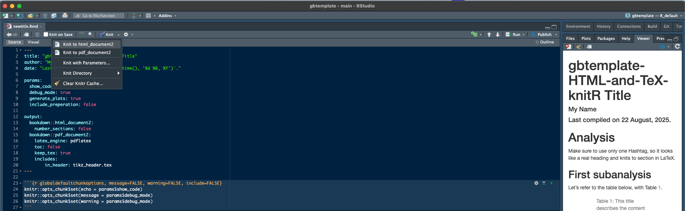

# gbtemplate

Includes my R package [gbtemplate](https://github.com/brueckmann/gbtemplate) that is a [Rmarkdown](https://rmarkdown.rstudio.com/) template called gbtemplate-HTML-and-TeX-knitR.

This template allows you to knit a Rmd file to HTML_document2 and PDF_document2 over [bookdown](https://github.com/rstudio/bookdown "https://github.com/rstudio/bookdown") to knit

a)  a PDF with the TeX files where [tikz (using tikzDevice)](https://daqana.github.io/tikzDevice/ "https://daqana.github.io/tikzDevice/") images are used **and**

b)  quickly knitted HTMLs with pngs in it.

## Installation

Install in R via [pak](https://pak.r-lib.org/ "https://pak.r-lib.org/")

``` r
pak::pkg_install("brueckmann/gbtemplate")
```

or [devtools](https://github.com/r-lib/devtools "https://github.com/r-lib/devtools")

``` r
devtools::install_github("brueckmann/gbtemplate")
```

## Usage

The easiest way is probably to go in R Studio click on File -\> New File -\> R Markdown... –\> select From Template and search for: gbtemplate-HTML-and-TeX-knitR {gbtemplate}, see screenshot:



This procedure is also explained in the [Chapter 17 of the bookdown book](https://bookdown.org/yihui/rmarkdown/document-templates.html?version=2025.05.0%2B496&mode=desktop "https://bookdown.org/yihui/rmarkdown/document-templates.html?version=2025.05.0%2B496&mode=desktop").

Next, fill in the fields that show up in the template, with your information.

The template currently offers 4 parameter settings or params:

-   `show_code: false`

-   `debug_mode: true`

-   `generate_plots: true`

-   `include_preperation: false`

These allow you to show or hide `code` (aka `echo`), output warnings and messages (in `debug_mode`) and to include or exclude some preparatory text and data wrangling (i`nclude_preperation`) and an option to `generate_plots` (default) or to remove all plots (not recommended, when you refer to, or more precisely, [cross-reference](https://bookdown.org/yihui/rmarkdown-cookbook/cross-ref.html "Some important notes on cross-referencing tables and figures in RMarkdown documents") these plots in your text).

You can toggle this over the interface in RStudio or through changing the `params` from false to true and vice versa.

Select if you want to knit it to PDF (using `pdf_document2`) or to HTML (using `html_document2`) in the RStudio interface like this:



### Why `pdf_document2` or `html_document2` from `bookdown`

Using `pdf_document2` or `html_document2` from the [bookdown](bookdown.org "bookdown.org") package allows cross-referencing of Figures and Tables, and these cross-references are also in the LaTeX output.

Read more about this here: <https://bookdown.org/yihui/rmarkdown-cookbook/cross-ref.html>

## Note (of caution)

This is very much work in progress and just one way for me to store this, that's why it is currently version 0.0.1.

Let me know if you discover bugs, etc. Not that I expect anyone to ever use this.
